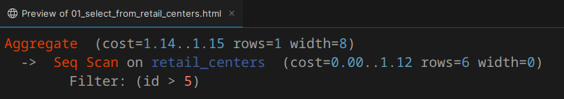

# python-study-faker

## 1. Описание

Моё изучение построителя запросов PostgreSQL и интеграции PostgreSQL с Python (библиотека Faker для заполнения базы
данных).

## 2. Требования

- Python;
- Установленный и настроенный PostgreSQL.

## 3. Подготовка

1. Склонировать проект и перейти в папку с ним;
2. Инициализировать `venv`:

    ```sh
    python -m venv ./venv
    ```

3. Установить все зависимости:

   ```sh
   ./venv/bin/pip install -r requirements.txt
   ```

## 4. Настройка

Настройки можно поменять в файле `./python/main.py`:

```python
retail_centers_number = 10
shipped_items_number = 1000000
transportation_events_number = 10
item_transportations_number = shipped_items_number * transportation_events_number

retail_centers_number_parts = 1
shipped_items_number_parts = 100
transportation_events_number_parts = 1
item_transportations_number_parts = shipped_items_number_parts

# Количество слов в словаре для заполнения поля "comment" в таблице "item_transportations"
words_in_dictionary = 1000
```

## 5. Инициализация и заполнение БД

```sh
./1_reset.sh
```

## 6. Получение планов запросов

```sh
./2_query.sh
```

Данная команда получит планы запросов для всех SQL-скриптов в папке `./sql/2_query`.

- Команда использует вставки `INSERT` (всегда задаёт `use_copy_instead_of_insert = False`), так как `plpy.execute` не поддерживает чтение из `STDIN`;
- План запроса в текстовом виде сохранится рядом с файлом `.sql` в файл с расширением `.log`;
- Дополнительно, при помощи сайта https://explain.tensor.ru/ будет получен раскрашенный HTML, который будет сохранён рядом с файлом `.sql` в файл с расширением `.html`.
  Его можно скопировать из IDE от JetBrains для вставки в Microsoft Word или LibreOffice Writer с сохранением как цветов, так и текста.
  Для этого нужно в IDE нажать ПКМ по файлу - `Open In` - `Browser` - `Built-in Preview`:

  

## 7. Дополнительно

### 7.1. Вывод SQL-команд

Запустить проект в IDE или командой:

```sh
./venv/bin/python main.py
```

Вставки выводятся при помощи метода `COPY`.
Чтобы выводить `INSERT`, в файле `./python/main.py` изменить `use_copy_instead_of_insert` с `True` на `False`.

### 7.2. Создание полного дампа БД

```sh
./shell/dump.sh
```

Дамп будет создан в папке `./sql/0_dumps`

### 7.3. Выполнение конкретного SQL-файла

```sh
./shell/psql.sh <sql_file_path>
```

Данную команду также можно использовать для применения дампа - например:

```sh
./shell/psql.sh ./dumps/ups_system_db_dump_2025-04-04_23-30-34.sql
```
